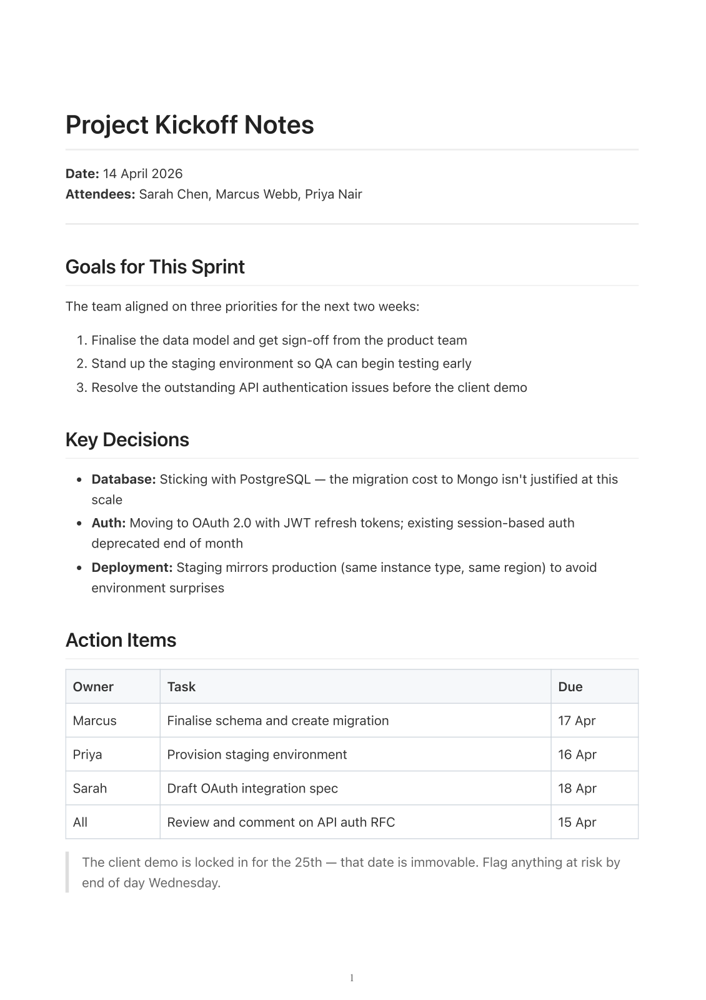
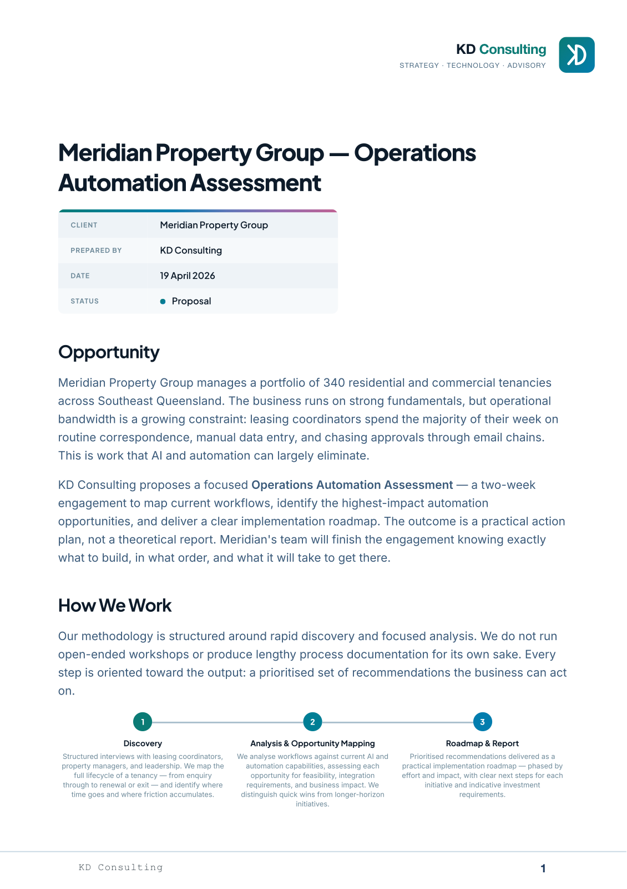

# Sakusei

Sakusei is a build system for creating PDF documents from Markdown source files. It supports:

- **Markdown to PDF conversion** via `md-to-pdf`
- **ERB template evaluation** for dynamic content
- **Hierarchical style packs** for consistent document styling
- **File inclusion** for multi-file documents
- **PDF concatenation** for combining multiple documents

---

**Sakusei** (作成) — from the Japanese words meaning "creation," "making," or "craft."

Like a master artisan refining their craft, Sakusei transforms raw Markdown into beautifully crafted PDF documents. Every document is an act of creation — structured, styled, and brought to life with precision.

The name embodies the philosophy behind this tool: documents aren't just generated, they're _crafted_.


## Installation

### Ruby Gem

```bash
gem install sakusei
```

### Build from Source

```bash
git clone https://github.com/keithrowell/sakusei
cd sakusei
bundle install
rake install
```

**Prerequisites:**
- Ruby 3.0+
- Node.js (for md-to-pdf)
- pdfunite or pdftk (for PDF concatenation)

## Quick Start

### Build a PDF from Markdown

```bash
sakusei build document.md
```

Or simply (build is the default command):

```bash
sakusei document.md
```

Extension is optional - `.md`, `.text`, or `.markdown` will be tried:

```bash
sakusei document    # Looks for document.md, document.text, or document.markdown
```

Auto-open after building:

```bash
sakusei document.md --open
```

### Initialize a Style Pack

```bash
sakusei init my_company
```

### Concatenate PDFs

```bash
sakusei concat part1.pdf part2.pdf -o combined.pdf
```

## Examples

### Basic usage

Plain Markdown — headings, lists, a table, a blockquote — built with the default style pack:

```markdown
# Project Kickoff Notes

**Date:** 14 April 2026
**Attendees:** Sarah Chen, Marcus Webb, Priya Nair

---

## Goals for This Sprint

The team aligned on three priorities for the next two weeks:

1. Finalise the data model and get sign-off from the product team
2. Stand up the staging environment so QA can begin testing early
3. Resolve the outstanding API authentication issues before the client demo

## Key Decisions

- **Database:** Sticking with PostgreSQL — the migration cost to Mongo isn't justified at this scale
- **Auth:** Moving to OAuth 2.0 with JWT refresh tokens; existing session-based auth deprecated end of month
- **Deployment:** Staging mirrors production (same instance type, same region) to avoid environment surprises

## Action Items

| Owner  | Task                                | Due    |
|--------|-------------------------------------|--------|
| Marcus | Finalise schema and create migration | 17 Apr |
| Priya  | Provision staging environment       | 16 Apr |
| Sarah  | Draft OAuth integration spec        | 18 Apr |
| All    | Review and comment on API auth RFC  | 15 Apr |

> The client demo is locked in for the 25th — that date is immovable.
> Flag anything at risk by end of day Wednesday.
```

Built with `sakusei build getting-started.md`:

[](examples/getting-started.pdf)

The full source is at [`examples/getting-started.md`](examples/getting-started.md).


### Style packs and Vue components

The source for a one-page consulting proposal, using a custom style pack with `DocMeta`, `ProcessSteps`, and `DeliverableCards` components:

```markdown
# Meridian Property Group — Operations Automation Assessment

<vue-component name="DocMeta"
  client="Meridian Property Group"
  preparedBy="KD Consulting"
  date="<%= today('%d %B %Y') %>"
  status="Proposal"
  />


## Opportunity

Meridian Property Group manages a portfolio of 340 residential and commercial tenancies
across Southeast Queensland. The business runs on strong fundamentals, but operational
bandwidth is a growing constraint: leasing coordinators spend the majority of their week
on routine correspondence, manual data entry, and chasing approvals through email chains.
This is work that AI and automation can largely eliminate.

KD Consulting proposes a focused **Operations Automation Assessment** — a two-week
engagement to map current workflows, identify the highest-impact automation opportunities,
and deliver a clear implementation roadmap.


## How We Work

Our methodology is structured around rapid discovery and focused analysis. We do not run
open-ended workshops or produce lengthy process documentation for its own sake. Every
step is oriented toward the output: a prioritised set of recommendations the business
can act on.

<vue-component name="ProcessSteps" steps='[
  {
    "title": "Discovery",
    "description": "Structured interviews with leasing coordinators, property managers,
    and leadership. We map the full lifecycle of a tenancy — from enquiry through to
    renewal or exit — and identify where time goes and where friction accumulates."
  },
  {
    "title": "Analysis & Opportunity Mapping",
    "description": "We analyse workflows against current AI and automation capabilities,
    assessing each opportunity for feasibility, integration requirements, and business
    impact."
  },
  {
    "title": "Roadmap & Report",
    "description": "Prioritised recommendations delivered as a practical implementation
    roadmap — phased by effort and impact, with clear next steps for each initiative and
    indicative investment requirements."
  }
]' />


## Deliverables

<vue-component name="DeliverableCards" columns="3" items='[
  {
    "title": "Workflow Assessment",
    "description": "A clear map of current operations across leasing, tenancy management,
    and communications — documenting where time is spent and where the significant
    friction points lie."
  },
  {
    "title": "Automation Opportunity Register",
    "description": "A structured register of identified automation opportunities, each
    assessed for business impact, implementation effort, and integration requirements
    with existing systems."
  },
  {
    "title": "Implementation Roadmap",
    "description": "A phased, prioritised action plan with recommended sequencing,
    indicative timelines, and investment estimates — ready to brief a delivery team or
    internal stakeholders."
  }
]' />
```

Built with `sakusei build meridian-proposal.md -s kd-consulting`:

[](examples/meridian-proposal.pdf)

The full source is at [`examples/meridian-proposal.md`](examples/meridian-proposal.md).


## Style Packs

Style packs are stored in `.sakusei/style_packs/` directories. Sakusei searches for style packs by walking up the directory tree from your source file.

```
.sakusei/
└── style_packs/
    └── my_company/
        ├── config.js      # md-to-pdf configuration
        ├── style.css      # Stylesheet
        ├── header.html    # Header template
        └── footer.html    # Footer template
```

## File Inclusion

Include other markdown files in your document:

```markdown
# My Document

<!-- @include ./introduction.md -->

<!-- @include ./chapter1.md -->
```

## ERB Templates

Use ERB for dynamic content:

```markdown
# Report Generated <%= today %>

Environment: <%= env('RAILS_ENV', 'development') %>
```

## Page Breaks

### Manual Page Breaks

Insert a page break with the `::break::` shorthand:

```markdown
# Chapter 1

Content here...

::break::

# Chapter 2

More content...
```

This expands to `<div class="page-break"></div>` before rendering. You can also use that HTML directly if you prefer.

Available classes:
- `.page-break` or `.page-break-after` - Break after this element
- `.page-break-before` - Break before this element

### Automatic Keep-Together

The base stylesheet automatically prevents page breaks inside these elements:
- Tables (including rows)
- Code blocks (`<pre>`)
- Blockquotes
- Images
- Figures and captions
- Definition lists (`<dl>`, `<dt>`, `<dd>`)
- Details/summary sections
- Math blocks (KaTeX)
- Custom elements: `.admonition`, `.callout`, `.card`, `.box`

To force keep-together on any element, add the `.keep-together` class:

```markdown
<div class="keep-together">

This content will not be split across pages.

| Table | Data |
|-------|------|
| A     | 1    |
| B     | 2    |

</div>
```

## Build Scripts

Create a `.sakusei_build` file for complex builds:

```yaml
steps:
  - command: build
    files:
      - cover.md
      - content/*.md
    output: document.pdf
    style: my_company
```

## License

MIT
